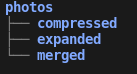

# GPBA - Google Photos Backup Assistant

A Rust CLI to take photos downloaded from Google Takeout and get them optimized for backing up to a third-party service.

This is a tool I built for myself so help with backing up my photos. If you want to make a feature request file an issue. I can't guarentee it will get done but PRs are always welcome.

## How to use the tool

Create your new directory structure using the `-n` flag with the directory name

The file structure example is below.

Put your downloaded compressed files in the compressed directory.

Run the tool again with just the directory name and it will decompress the files, merge them into the merged directory, and delete the old files.
